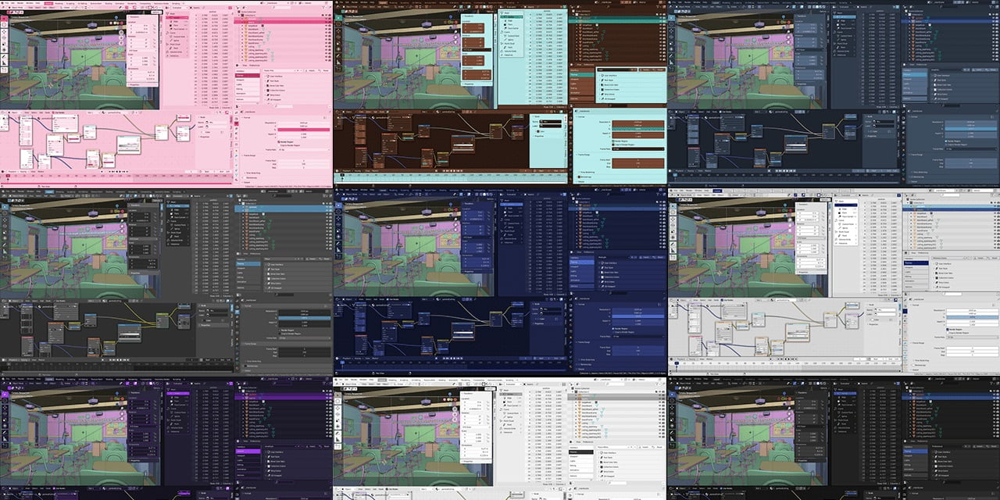

|||
|-|-|
||**モンブラン** Blenderで作成したモンブランです。Cyclesレンダーを使用しました。 <a target="_blank" href="https://twitter.com/kame404/status/1370351126327926784">詳しく見る</a>|
||**パンケーキ** Blenderで作成したパンケーキです。Cyclesレンダーを使用しました。 <a target="_blank" href="https://twitter.com/kame404/status/1102131616153890816">詳しく見る</a>|
||**プリン** Blenderで作成したプリンです。Cyclesレンダーを使用しました。 <a target="_blank" href="https://twitter.com/kame404/status/1436628177439232005">詳しく見る</a>|
||**Blender UIテーマ** 最新のBlenderに対応した、独創的なBlender UIテーマを公開しています。 <a target="_blank" href="https://github.com/kame404/Blender-Themes">詳しく見る</a>|
||**田んぼのある生活** ClusterGAMEJAM2021 in Summer デジタルハリウッド大学賞受賞。モデラーとして参加しました。 <a target="_blank" href="https://cluster.mu/w/ff975882-aa04-4d9f-8ccc-959fc7a77fd7">詳しく見る</a>|
||**みじんこの森** みじんことの会話を楽しむAndroidアプリです。みじんこは毎日少しずつ増えていきます。 <a target="_blank" href="https://play.google.com/store/apps/details?id=com.kame404.Daphnia">詳しく見る</a>|